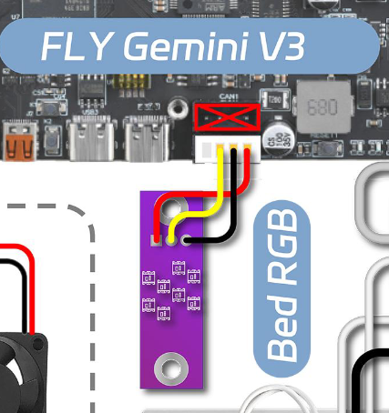
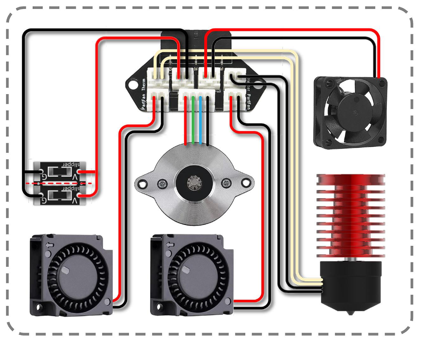
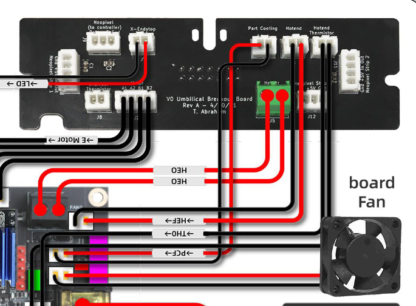

# Errata

**`VORON` Manual**: <https://github.com/VoronDesign/Voron-0/blob/Voron0.2r1/Manuals/VORON_V0.2r1_Assembly_Manual.pdf> (Version referenced here: [9b13baa1](https://github.com/VoronDesign/Voron-0/blob/9b13baa1806497ae7a028f273a8d9d4273fbc3ef/Manuals/VORON_V0.2r1_Assembly_Manual.pdf))

**`SIBOOR` Supplementary**: <https://github.com/Lzhikai/SIBOOR-Voron-0.2-AUG/blob/main/supplementary/SIBOOR%200.2%20AUG%20Supplementary%20Instructions.pdf> (Version referenced here: [a7ac3643](https://github.com/Lzhikai/SIBOOR-Voron-0.2-AUG/blob/a7ac3643d21dcb62dc93d0c126f8b84060b94258/supplementary/SIBOOR%200.2%20AUG%20Supplementary%20Instructions.pdf))

---

#### `VORON` Page 92 - Kirigami

The method of mounting the Z-Lead-Screw is the same for the kirigami bed

#### `VORON` Page 171 - Hotend LEDs

This is the moment to wire up the `HE-LED`. Thread the wire, then glue the LEDs in place. Double check that there is no short on the HE-LED wiring. In Diode-testing, I'm reading `2.5V` (forward-voltage? voltage-drop?) on my HE-LEDs.

#### `VORON` Page 180 - Hotend Tube

Milky PTFE tube for the hotend tube (smaller diameter)

#### `SIBOOR` Page 15 - Electronics and cabling

!!! danger

    Double check all wiring, do not trust what I or the guides write!

The Kirigami Bed PCB with the Logo Neopixels is displayed from the top down. When pinning your connector, make sure the polarity matches the silk screen on the PCB!

Double-check the fan polarity on the toolhead PCB. Some kits come with the polarity wrong on all fans! Check <https://github.com/VoronDesign/Voron-Hardware/blob/master/V0-Umbilical/Images/Toolhead_PCB_Layout.png> for the PCB layout, and make sure to measure continuity from the pin on the toolhead PCB to the fan connector going into the mainboard.

Pay extra attention to the Umbilical frame PCB, as here, the fan polarity might be swapped for **some**, but not **all** fans!

#### `VORON` Page 191/`SIBOOR` Page 17 - Back Panel

Flip the panel around. USB Ports to the left, 4 holes on the panel on the top

#### `VORON` Page 224 - HE wiring

Skip, as the kit comes with umbilical PCB

#### `SIBOOR` Page 20 - Spacers for ADXL

If you find it difficult to mount the ADXL, `mumucowface` recommends to leave away the spacer between screw and ADXL. 

!!! info 

    It is rumored that while the ADXL on the back will be "good enough", best results are achieved with an accelerometer that is mounted directly on the nozzle (or between nozzle and heatbreak). Tested and working USB accelerometers (with their own MCU) are:
    
    - [FYSETC Nozzle Input Shaper](https://www.fysetc.com/products/fysetc-adxl345-nozzle-pcb-board-nozzle-input-shaper-easy-to-install-high-precision-data-module-for-voron-3d-printers)
    - [BigTreeTech ADXL345 V2.0](https://biqu.equipment/products/adxl-345-accelerometer-board-for-36-stepper-motors?variant=40446852726882)

#### `VORON` Page 227 - Bowden tubes

Clear FEP for the reverse bowden from toolhead to back (larger diameter)

#### `SIBOOR` Page 23 - Linux setup

If you use an ethernet cable, skip this step

#### `SIBOOR` Page 25 - First start

- Before powering on for the first time, double-check your wiring. See [my build guide](../../guides/build_guide.md).
- You will get errors in klipper at this point. Replace the printer.cfg with [Lzhikai/SIBOOR-Voron-0.2-AUG/printer.cfg](https://github.com/Lzhikai/SIBOOR-Voron-0.2-AUG/blob/main/printer.cfg). Copy `V0Display.cfg` from that repository too.
- You will then get an error about the display mcu not being available. Flash the display now (see <https://github.com/VoronDesign/Voron-Hardware/blob/master/V0_Display/Documentation/Setup_and_Flashing_Guide.md>) and update `V0Display.cfg`, or comment out line 3 in `printer.cfg` for the time being. Flashing could require updating klipper.
- Once klipper is running, proceed with <https://www.klipper3d.org/Config_checks.html> and <https://docs.vorondesign.com/build/startup/>
- Siboors `printer.cfg` should be an inspiration at best. You must still do all verification steps as per https://www.klipper3d.org/Config_checks.html and https://docs.vorondesign.com/build/startup/ , especially [calibrate sensorless homing](https://www.klipper3d.org/TMC_Drivers.html#sensorless-homing) and [calibrate the z endpoint](./calibrating_z_height.md)
