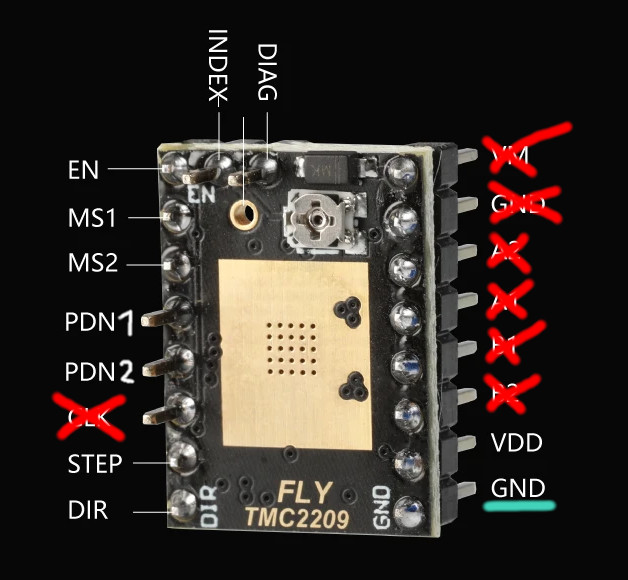
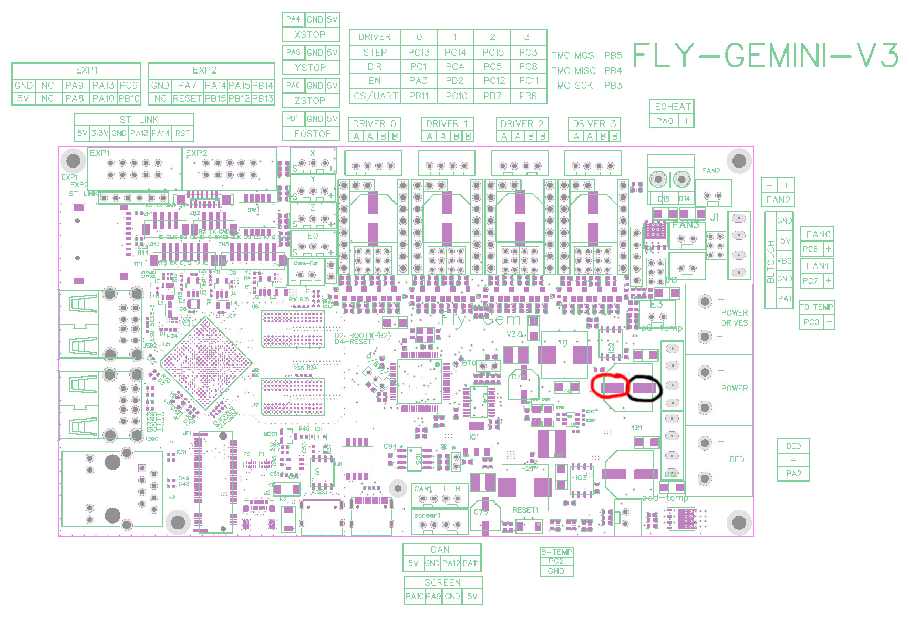
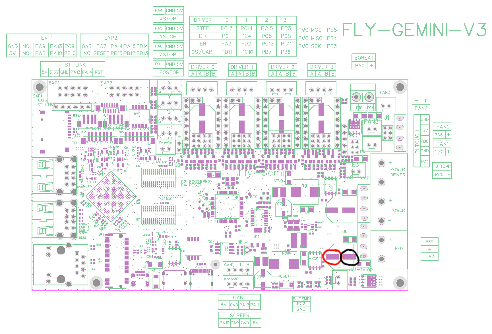
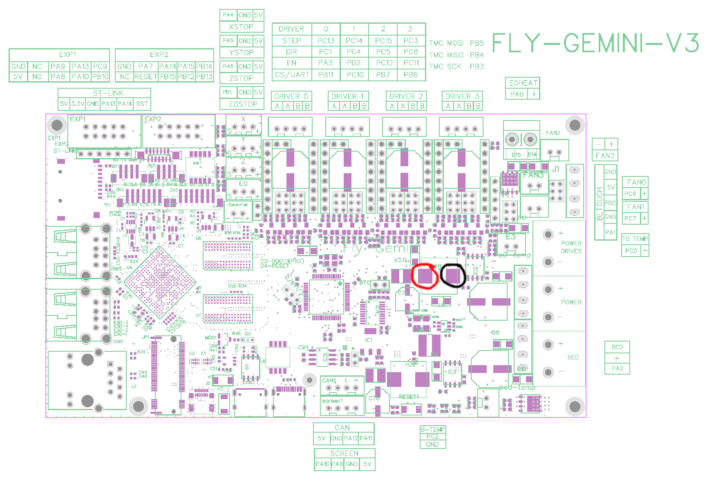
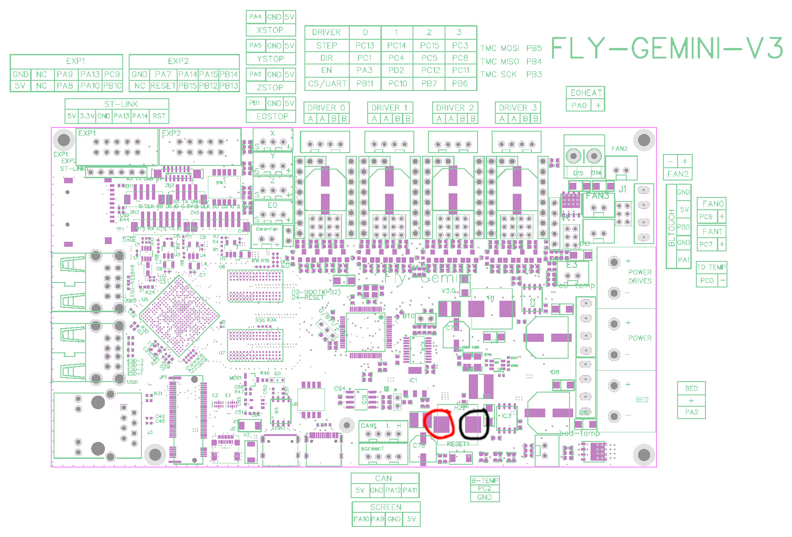
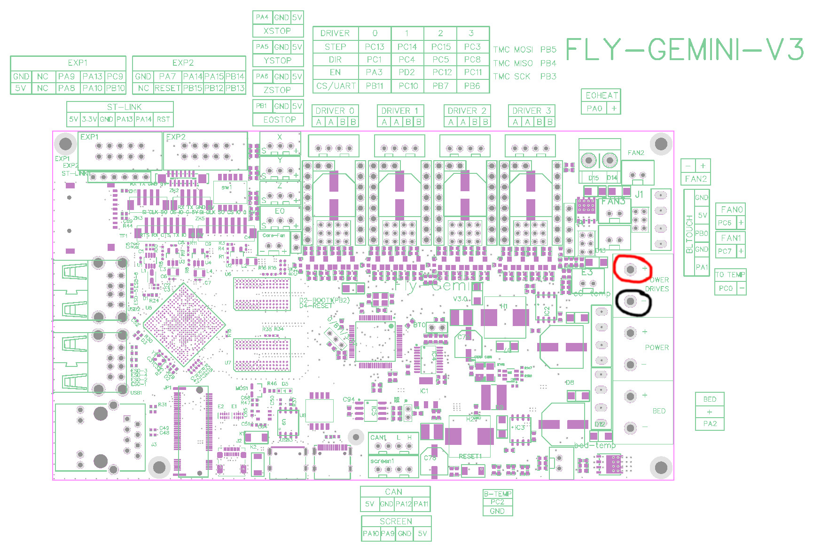

# Faulty Boards or Drivers Investigation

**This guide is for an investigation of a faulty board or driver. Unless specifically asked to do so, do not follow this guide.**

## Introduction

**All of this measurements are to be taken without live current. Phyiscally remove the power cable (from the PSU to your power socket) and make sure any capacitors are drained (no light on the mainboard dimmly lit).**

We are only measuring resistance and continuity.

## Driver Measurements

!!! danger

    Do not plug the driver into the board for this, and do not measure any other pins than the ones on the picture.

Flip the driver around so that you can easily probe the pins. Measure the resistance from **GND** (now on the bottom **left**) to each of the non-crossed out pins.

## Mainboard Measurements

!!! danger

    **We are probing the Gemini V3. Remove the power supply cable before taking these measurements. No live current!**

### Capacitors

#### Top Capacitor

#### Bottom Capacitor

### Inductors

#### Inductor `H1`

#### Inductor `H2`

### Driver Power

Measure this one twice, once with the PSU connected to the mainboard, **but not plugged to your mains (no 110V/230V)! No live current**.

## Periphals Measurements

### HE-LED

Measure the voltage drop/forward voltage (diode testing) between the HE-LED wires. Check the manual of your multimeter on how to do this.

| Who      | FV of HE-LED `+` to `-` |
| -------- | ----------------------- |
| Reemo3dp | 2.5V                    |

## Measurements

| Measurement          | Reemo3dp (working)                | Ben (broken) | Ben (2nd MM)   | KaeAl (magic smoke on IC3) | chrizz (pristine)       |
| -------------------- | --------------------------------- | ------------ | -------------- | -------------------------- | ----------------------- |
| Driver: GND to VDD   | 770kΏ                             | ~= Reemo3dp  | 720kΏ          | 670kΏ                      | 514-522kΏ               |
| Driver: GND to DIR   | 20kΏ                              | ~= Reemo3dp  | 147.7kΏ        | 141.7kΏ                    | 150kΏ                   |
| Driver: GND to STEP  | 5mΏ                               | ~= Reemo3dp  | 4.623mΏ        | 1.5mΏ                      | 7.38mΏ, extruder 11.5mΏ |
| Driver: GND to PDN2  | 20kΏ (MKS TMC2209) - (Siboor) | - (Siboor)   | - (Siboor)     | - (Siboor)                 | - (Siboor)              |
| Driver: GND to PDN1  | 20kΏ                              | ~= Reemo3dp  | 20.14kΏ        | 19.9kΏ                     | 20kΏ                    |
| Driver: GND to MS2   | 157kΏ                             | ~= Reemo3dp  | 148.2kΏ        | 141.5kΏ                    | 133-136kΏ               |
| Driver: GND to MS1   | 157kΏ                             | ~= Reemo3dp  | 147.7kΏ        | 141.6kΏ                    | 134-136kΏ               |
| Driver: GND to EN    | 789kΏ                             | ~= Reemo3dp  | 739kΏ          | 676kΏ                      | 511-526kΏ               |
| Driver: GND to INDEX | 8.23kΏ                            | ~= Reemo3dp  | 5.3mΏ          | 8.1kΏ                      | 7.9-8.4kΏ               |
| Top Cap              | -                                 | inf          | 8mΏ - 3.6mΏ    | 400kΏ/none                 | 240kΏ/240mΏ ?!          |
| Bottom Cap           | -                                 | inf          | 6.3mΏ - 3.43mΏ | 60.9Ώ                      | 200kΏ/240mΏ ?!          |
| Inductor H1          | -                                 | 0.06Ώ        | 0.2Ώ           | 0.4Ώ                       | 0.0Ώ                    |
| Inductor H2          | -                                 | 0.06Ώ        | 0.2Ώ           | .4Ώ                        | 0.0Ώ                    |
| PSU                  | -                                 | -            | -              | Continuity, no resistance  | -                       |
