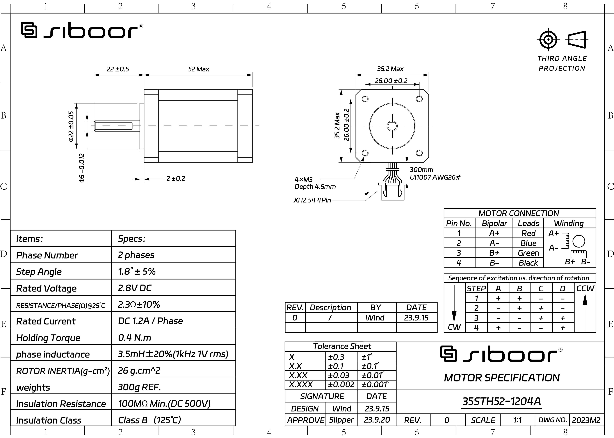
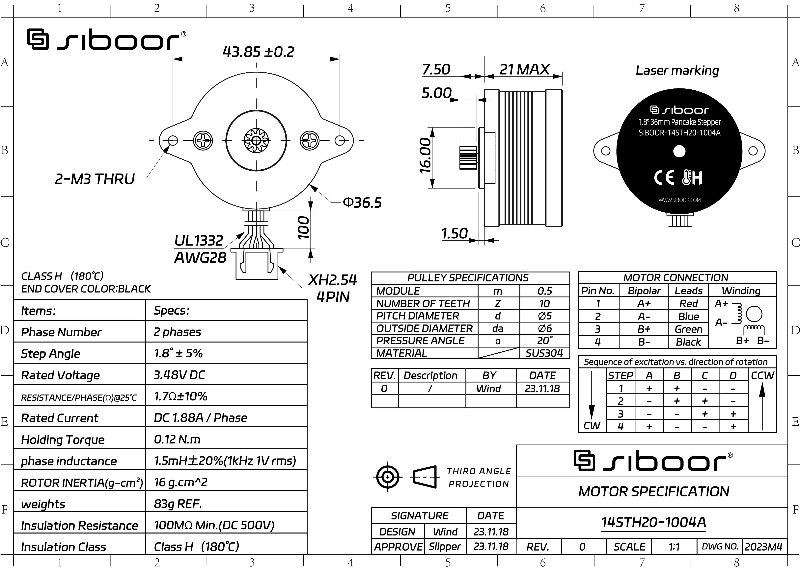
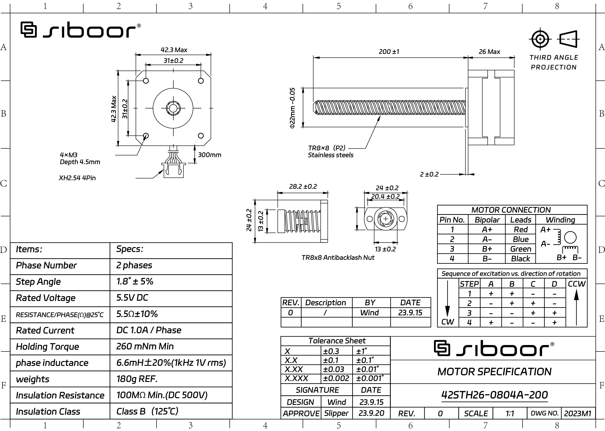

# Motor Settings

## Motor Specs







## Motor Settings

```toml
[stepper_x]
microsteps: 64
full_steps_per_rotation: 200
rotation_distance: 40

[stepper_y]
microsteps: 64
full_steps_per_rotation: 200
rotation_distance: 40

[stepper_z]
microsteps: 32
rotation_distance: 8

[extruder]
microsteps: 16
rotation_distance: 23
gear_ratio: 50:10

[tmc2209 extruder]
stealthchop_threshold: 999
```

## TMC Autotune

From https://github.com/andrewmcgr/klipper_tmc_autotune/issues/63

```toml
[motor_constants siboor-35sth52-1204a_fixed]
#Siboor BOM Voron 0.2 steppers
resistance: 2.3
inductance: 0.0035
holding_torque: 0.36
max_current: 1.2
steps_per_revolution: 200

[motor_constants siboor-42sth26-0804a-200]
resistance: 5.50
inductance: 0.0066
holding_torque: 0.26
max_current: 1.00
steps_per_revolution: 200

[autotune_tmc stepper_x]
motor: siboor-35sth52-1204a_fixed
sg4_thrs: YOU_HAVE_TO_CALIBRATE_SENSORLESS_HOMING_YOURSELF
tuning_goal: performance

[autotune_tmc stepper_y]
motor: siboor-35sth52-1204a_fixed
sg4_thrs: YOU_HAVE_TO_CALIBRATE_SENSORLESS_HOMING_YOURSELF
tuning_goal: performance

[autotune_tmc stepper_z]
motor: siboor-42sth26-0804a-200
tuning_goal: performance
```

## Macro to switch between PERFORMANCE and SILENT while hard-capping velocity

This macro (in principle) allows to hot-switch between performance and silent. It redefines `SET_VELOCITY_LIMIT` assuming your slicer will use that to set movement limits, and rejects any values that go beyond the set caps. It allows to switch to silent printing without reslicing the model and without loosing steps, at the cost of potentially moving too slow than necessary.

```toml linenums="1" hl_lines="33"
[gcode_macro SET_VELOCITY_LIMIT]
rename_existing: _SET_VELOCITY_LIMIT
variable_cap_enabled: False
variable_velocity: 0
variable_accel: 0
variable_accel_to_decel: 0
variable_square_corner_velocity: 0
gcode:
  
    _SET_VELOCITY_LIMIT {rawparams}
  
    
      SET_GCODE_VARIABLE MACRO=SET_VELOCITY_LIMIT VARIABLE=cap_enabled VALUE=True
      SET_GCODE_VARIABLE MACRO=SET_VELOCITY_LIMIT VARIABLE=velocity VALUE={params.VELOCITY | default(0) | float }
      SET_GCODE_VARIABLE MACRO=SET_VELOCITY_LIMIT VARIABLE=accel VALUE={params.ACCEL | default(0) | float }
      SET_GCODE_VARIABLE MACRO=SET_VELOCITY_LIMIT VARIABLE=accel_to_decel VALUE={params.ACCEL_TO_DECEL | default(0) | float }
      SET_GCODE_VARIABLE MACRO=SET_VELOCITY_LIMIT VARIABLE=square_corner_velocity VALUE={params.SQUARE_CORNER_VELOCITY | default(0) | float }
    
      SET_GCODE_VARIABLE MACRO=SET_VELOCITY_LIMIT VARIABLE=cap_enabled VALUE=False
      SET_GCODE_VARIABLE MACRO=SET_VELOCITY_LIMIT VARIABLE=velocity VALUE=0
      SET_GCODE_VARIABLE MACRO=SET_VELOCITY_LIMIT VARIABLE=accel VALUE=0
      SET_GCODE_VARIABLE MACRO=SET_VELOCITY_LIMIT VARIABLE=accel_to_decel VALUE=0
      SET_GCODE_VARIABLE MACRO=SET_VELOCITY_LIMIT VARIABLE=square_corner_velocity VALUE=0
    
      _SET_VELOCITY_LIMIT { "VELOCITY={}".format([params.VELOCITY | float, velocity] | min) if params.VELOCITY else "" } { "ACCEL={}".format([params.ACCEL | float, accel] | min) if params.ACCEL else "" } { "ACCEL_TO_DECEL={}".format([params.ACCEL_TO_DECEL | float, accel_to_decel] | min) if params.ACCEL_TO_DECEL else "" } { "SQUARE_CORNER_VELOCITY={}".format([params.SQUARE_CORNER_VELOCITY | float, square_corner_velocity] | min) if params.SQUARE_CORNER_VELOCITY else "" }
    
  


[gcode_macro SILENT]
gcode:
  {action_respond_info("Silent activated")}
  SET_VELOCITY_LIMIT CAP=True VELOCITY=150 ACCEL=5000 ACCEL_TO_DECEL=2500 SQUARE_CORNER_VELOCITY=5
  SET_TMC_FIELD STEPPER=stepper_y FIELD=SGTHRS VALUE=YOU_HAVE_TO_CALIBRATE_SENSORLESS_HOMING_YOURSELF
  SET_TMC_FIELD STEPPER=stepper_x FIELD=SGTHRS VALUE=YOU_HAVE_TO_CALIBRATE_SENSORLESS_HOMING_YOURSELF
  AUTOTUNE_TMC STEPPER=stepper_y tuning_goal=silent sg4_thrs=YOU_HAVE_TO_CALIBRATE_SENSORLESS_HOMING_YOURSELF
  AUTOTUNE_TMC STEPPER=stepper_x tuning_goal=silent sg4_thrs=YOU_HAVE_TO_CALIBRATE_SENSORLESS_HOMING_YOURSELF

[gcode_macro PERFORMANCE]
gcode:
  {action_respond_info("Performance activated")}
  SET_VELOCITY_LIMIT CAP=False
  SET_TMC_FIELD STEPPER=stepper_y FIELD=SGTHRS VALUE=YOU_HAVE_TO_CALIBRATE_SENSORLESS_HOMING_YOURSELF
  SET_TMC_FIELD STEPPER=stepper_x FIELD=SGTHRS VALUE=YOU_HAVE_TO_CALIBRATE_SENSORLESS_HOMING_YOURSELF
  AUTOTUNE_TMC STEPPER=stepper_y tuning_goal=performance sg4_thrs=YOU_HAVE_TO_CALIBRATE_SENSORLESS_HOMING_YOURSELF
  AUTOTUNE_TMC STEPPER=stepper_x tuning_goal=performance sg4_thrs=YOU_HAVE_TO_CALIBRATE_SENSORLESS_HOMING_YOURSELF
```
