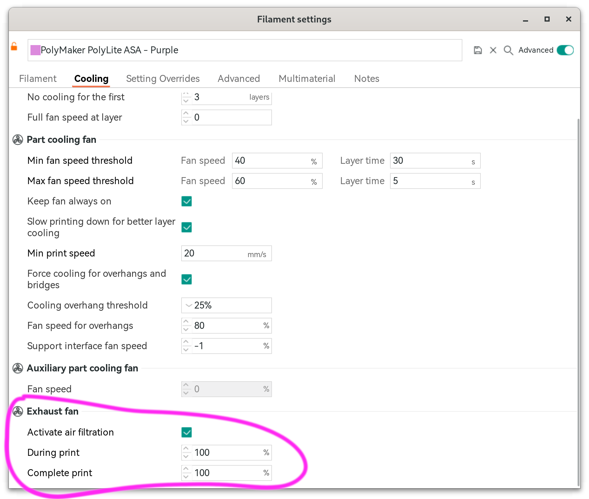
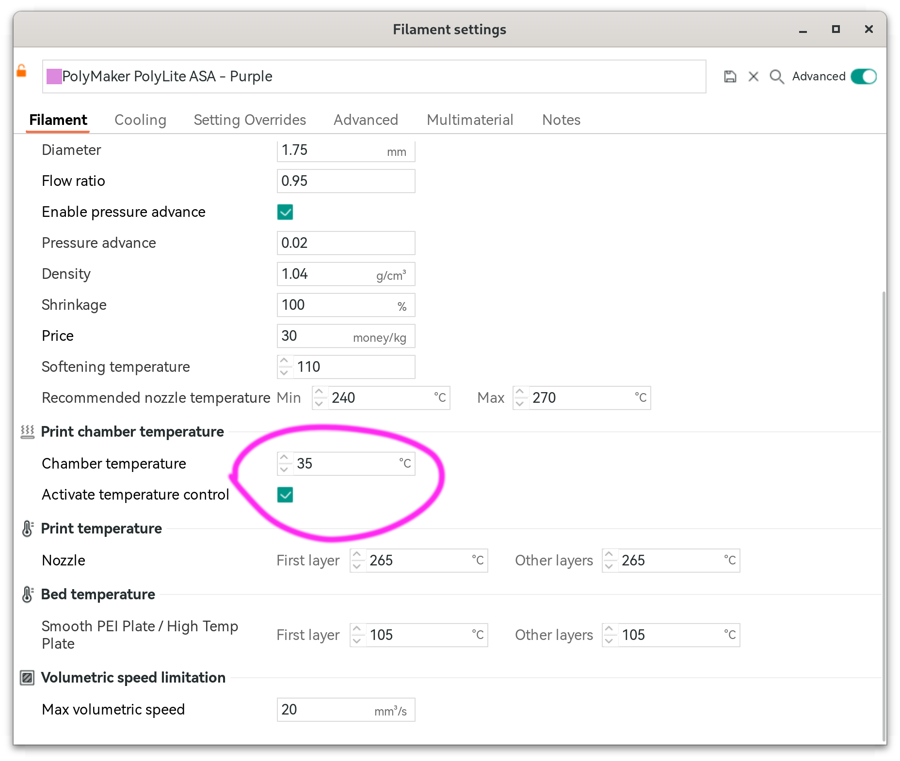

# Macros to use M106 and M191 with Nevermore



```toml
[gcode_macro M106]
rename_existing: M106.0
gcode:
  
  
    SET_FAN_SPEED FAN="nevermore" SPEED={(params.S | float)/255.0}
  
    M106.0 {rawparams}
  
```



```toml
[gcode_macro M191]
gcode:
  
  ;; From Heat-Soak Macro
  ;; fire up the heater
  SET_HEATER_TEMPERATURE HEATER=heater_bed TARGET=105
  ;; run the fans to circulate air
  _FAN_SOAK
  ;; home the printer
  G28
  ;; put the bed and nozzle where they're a safe distance apart
  G90
  G1 X60 Y60 Z80
  TEMPERATURE_WAIT SENSOR="temperature_sensor bme680" MINIMUM={min}
```
